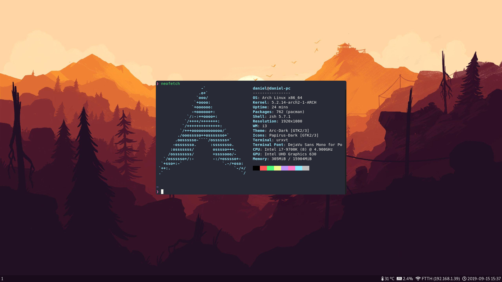

# My dotfiles
I use these dotfiles on [Arch Linux](https://gist.github.com/daniel-gallo/8583672dc0789624d6d83f0f815ea0ca) and macOS.

## Installation
If you are running Linux, you must install [several packages](https://gist.github.com/daniel-gallo/8583672dc0789624d6d83f0f815ea0ca#gui-packages) before setting these dotfiles up. Some things are hardcoded for me, for example:
* Wallpapers are stored in `/usr/share/wallpapers/` and called firewatch.jpg and firewatch.jpg-remote. I use that path so LightDM has permissions to access those.
* Screenshots are done pressing PRTSC and stored in `~/Pictures/`
* When i3 starts, `xset led` is run so my keyboard lights up.\
To use zsh, you must install zsh and set it as the default shell running `chsh -s $(which zsh)`.\
To set up the dotfiles, just do the following:
```bash
git clone https://github.com/daniel-gallo/dotfiles.git
cd dotfiles
./install
```
## Update
Running `./update` from the dotfiles folder will update the dotfiles, the zsh modules and the system packages (on macOS and Arch)
