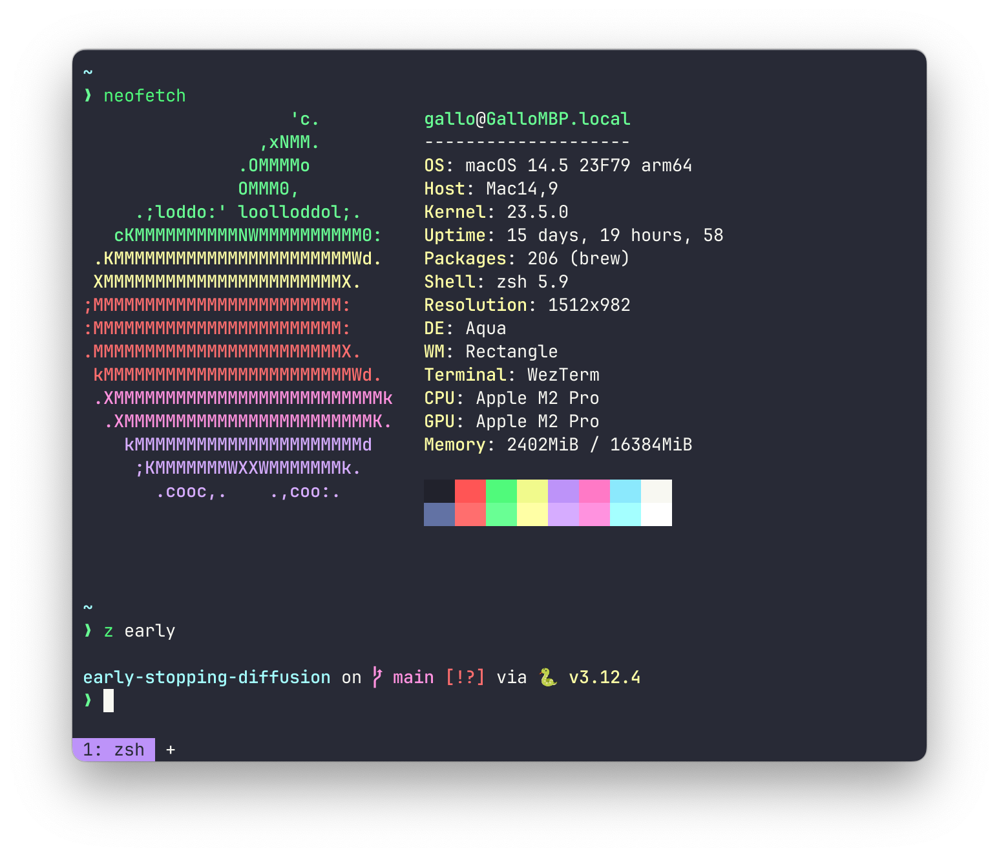

# My dotfiles



I use these dotfiles on macOS.

- My computer runs `brew update` and `brew upgrade` every day (using [homebrew-autoupdate](https://github.com/DomT4/homebrew-autoupdate)) so I don't have to wait for my computer to update all of its packages every time I use `brew`.
- I use vanilla `zsh` as my shell. Even though no frameworks are used, I enjoy these features:
  - Case insensitive block-style completion
  - Autosuggestions based on history
  - The [starship prompt](https://starship.rs)
  - Syntax highlighting

## Installation

First of all, these packages should be installed:

- homebrew-autoupdate
- starship
- zsh-autosuggestions
- zsh-completions
- zsh-history-substring-search
- zsh-syntax-highlighting
- zoxide

Then, just run the following:

```bash
git clone https://github.com/daniel-gallo/dotfiles.git
cd dotfiles
./install.sh
```

